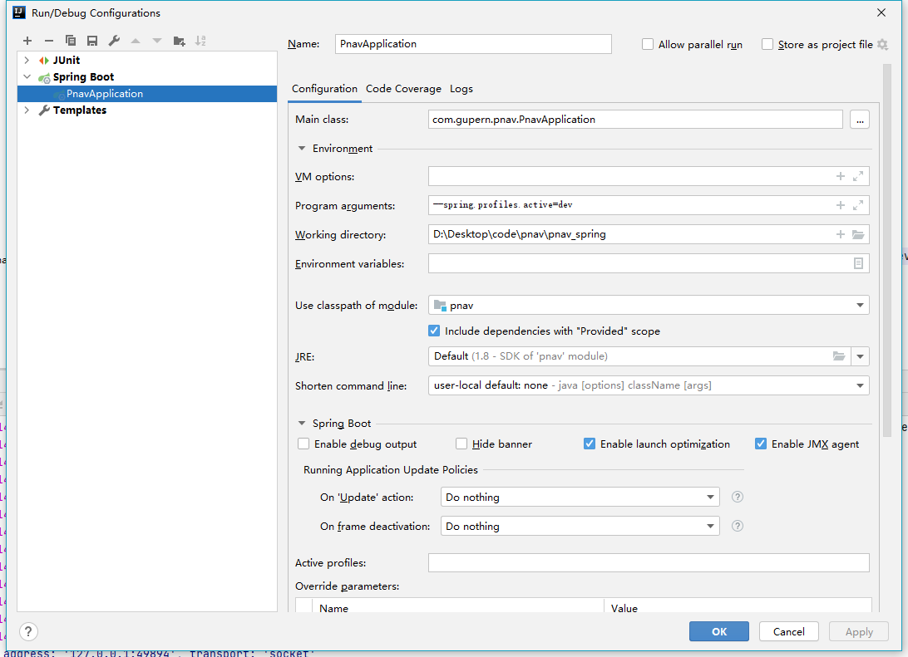

# PNAV后台

#### 介绍

PNAV后台代码仓库，使用spring cloud框架

#### 注意

需要引入/lib/下的两个jar包，在pom文件中加入dependency，且在build里加入

```
		<dependency>
			<groupId>commons-codec</groupId>
			<artifactId>commons-codec</artifactId>
			<version>1.9</version>
			<scope>system</scope>
			<systemPath>${pom.basedir}/lib/commons-codec-1.9.jar</systemPath>
		</dependency>
							<!--MANIFEST.MF 中 Class-Path 加入本地引入的lib包-->
							<Class-Path>lib/commons-codec-1.9.jar</Class-Path>

 * 说明：异常java.security.InvalidKeyException:illegal Key Size的解决方案
 * <ol>
 * 	<li>在官方网站下载JCE无限制权限策略文件（JDK7的下载地址：
 *      http://www.oracle.com/technetwork/java/javase/downloads/jce-7-download-432124.html</li>
 * 	<li>下载后解压，可以看到local_policy.jar和US_export_policy.jar以及readme.txt</li>
 * 	<li>如果安装了JRE，将两个jar文件放到%JRE_HOME%\lib\security目录下覆盖原来的文件</li>
 * 	<li>如果安装了JDK，将两个jar文件放到%JDK_HOME%\jre\lib\security目录下覆盖原来文件</li>
 
 https://zhangboyi.blog.csdn.net/article/details/115285334
```

#### 软件架构

-
按官网建议，小项目按模块来分，而不是按功能来分，更方便开发，详见: `https://docs.spring.io/spring-boot/docs/2.4.4/reference/htmlsingle/#using-boot-locating-the-main-class`

```
- main.java.com.gupern.pnav.h5: H5端的接口
    - H5Controller.java: H5端控制层
    - H5Service.java： H5端服务层
    - H5ServiceImpl.java： H5端实现层
    - H5Pojo***.java: H5端的各种Object，Pojo可为Dto、Vo、Dao、Pojo，具体见下方约定
    - H5Mapper***.java: H5端的各种Mapper
- main.java.com.gupern.pnav.pc: PC端的接口
    - PcController.java: Pc端控制层
    - PcService.java： Pc端服务层
    - PcServiceImpl.java： Pc端实现层
    - PcPojo***.java: Pc端的各种Object，Pojo可为Dto、Vo、Dao、Pojo，具体见下方约定，Pojo放前面，方便文件排序
    - PcMapper***.java: H5端的各种Mapper，Mapper放前面，方便文件排序
- main.resources.mapper: 存放Mybatis Mapper XML的文件夹
    - H5Mapper******.xml，Mapper放前面，方便文件排序
    - PcMapper******.xml，Mapper放前面，方便文件排序
- main.resources.application-{env}.properties: 配置文件
```

- 尽量使用springboot的sql注解来进行sql操作，减少xml文件，提高效率，参考：`https://spring.io/guides/gs/accessing-data-mysql/`

#### 约定

- Dao：数据库访问的object
- Dto：接收前端的object
- Vo：返回给前端的view object
- Pojo：其他无法区分的object
- Repository: 使用@Entity时继承CrudRepository的interface

#### db信息

db名: pnav

## 命令

- 使用maven package后，lib和jar会分离，只有第一次需要上传lib包，后续如果没有引用其他模块，就只需要更新jar包即可

#### 打包后运行命令，需指定properties文件

`java -jar .\pnav-1.0-SNAPSHOT.jar --spring.config.location=resources/application-{env}.properties`

#### IDEA工具配置参数

在启动时配置工作目录和profile.active=dev


#### linux启动命令，指定生产配置文件，并输出日志文件到pnav.log并后台运行

`nohup java -jar pnav-1.0-SNAPSHOT.jar --spring.config.location=resources/application-prod.properties > pnav.log 2&>1 &`

#### 查看日志

`tail -fn 300 pnav.log`

#### curl请求本地应用

`curl localhost:8080/client/list/1/2`

## 其他资料

#### 微信加解密工具

`https://developers.weixin.qq.com/doc/oplatform/Third-party_Platforms/2.0/api/Before_Develop/Technical_Plan.html`
`https://developers.weixin.qq.com/doc/oplatform/Third-party_Platforms/2.0/api/Before_Develop/Message_encryption_and_decryption.html`

#### 消息订阅功能

`https://developers.weixin.qq.com/miniprogram/dev/framework/open-ability/subscribe-message.html#%E8%AE%A2%E9%98%85%E6%B6%88%E6%81%AF%E6%B7%BB%E5%8A%A0%E6%8F%90%E9%86%92`